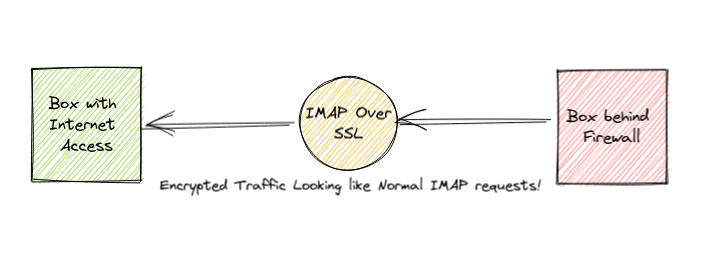

# Docker Stealth OpenVPN

<p align="center">
  
</p>

This is a project I was using personally to get access to the Internet
when I was living in Iran. Iran's infrastructure, is controlled by the
government, utilizes different technologies to block access to the
major internet services. One of the most advanced solutions (apart
from complete [Complete
Shutdown](https://fa.wikipedia.org/wiki/%D9%82%D8%B7%D8%B9%DB%8C_%D8%B3%D8%B1%D8%A7%D8%B3%D8%B1%DB%8C_%D8%A7%DB%8C%D9%86%D8%AA%D8%B1%D9%86%D8%AA_%D8%AF%D8%B1_%D8%A7%DB%8C%D8%B1%D8%A7%D9%86_(%DB%B1%DB%B3%DB%B9%DB%B8)))
is known as
[DPI](https://en.wikipedia.org/wiki/Deep_packet_inspection).

To my understanding, encrypting the outgoing traffic (or obfuscating
it by any other means), and passing it through standard internet
ports, reduce the chance of the service getting blocked (unless
someone reports the server's IP address).

That's where this setup is coming from. Basically what it does is:

- Utilizes [Stunnel](https://www.stunnel.org/) to encrypt the traffic.
- Use port 993 (IMAP TLS) to pass the traffic.
- Use OpenVPN as the VPN solution.

To provide Stunnel access securely, it relies on another
project I'm maintaining called [Docker
Stunnel](https://github.com/shahinism/docker-stunnel).

## How to use

### Run the Server

First make sure:

1. Using a Debian driven distro for the host server (preferably latest
   version of Ubuntu server).
2. Make sure [Docker](https://docker.com) and [Docker
   Compose](https://docs.docker.com/compose/) are installed on the server.
3. Make sure
   [UFW](https://www.digitalocean.com/community/tutorials/how-to-set-up-a-firewall-with-ufw-on-ubuntu-20-04)
   is enabled (to ensure the security of your server).
4. Make sure port 993 is accessible through any other gateway configured
   for your server. This is the only port that needs to be open. 

Then clone the project, and run:

```sh
make init  # To initialize the configuration
make start # To start the server
```

The server should be up and running in a few minutes.

### Create user:

You can use:

```sh
make new_user
```

To create a new user for the server. After user creation, you need to
send two files to your users:

1. stunnel.conf generated with make init command (located in the
   root directory of the project).
2. USERNAME.ovpn generated by make new_user command (located in
   the clients directory).

### Use as client

Make sure openvpn and stunnel packages are installed on your system. Then:

```sh
sudo cp stunnel.conf /etc/stunnel/stunnel.conf
sudo systemctl restart stunnel
```

And after that everytime you need to setup the VPN, you can just use openvpn CLI like:

```sh
sudo openvpn CLIENT.ovpn
```

